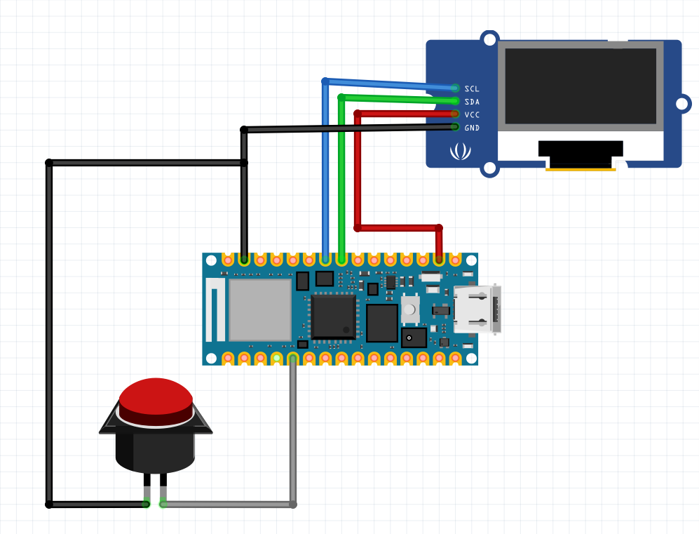
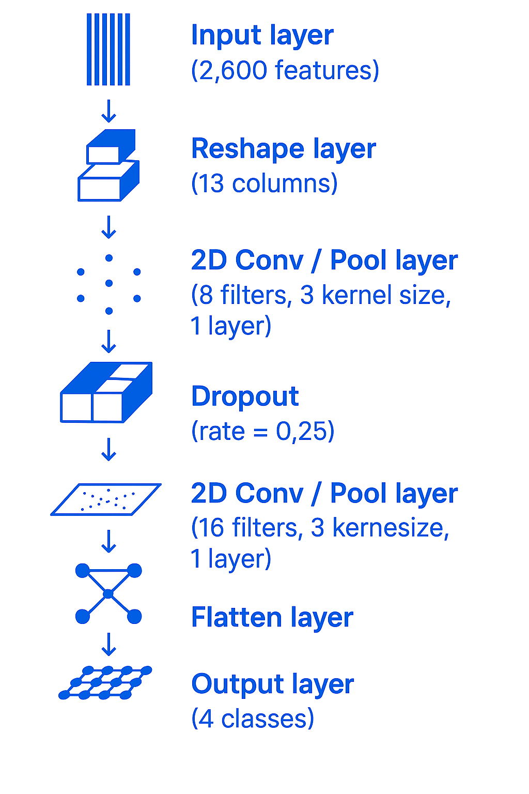

# 🎵 String Sense
---

## 📝 Project Overview
This project constructs an audio classification system capable of identifying four types of sounds: **guitar**, **bass guitar**, **other stringed instruments**, and **other** (including non-stringed instruments and environmental noise).

It employs **MFCC feature extraction** and a lightweight **2D Convolutional Neural Network (2D CNN)**, optimized for deployment on resource-constrained platforms such as **Arduino Nano 33 BLE Sense**.

🔗 [EdgeImpulse Public Link](https://studio.edgeimpulse.com/public/678434/live)

---

## 🔧 Hardware and Components
- **Arduino Board**: Arduino Nano 33 BLE Sense
- **Display**: OLED Screen
- **Input Components**: Two buttons for control

<p align="center">
  <br/>
  <b>Figure 1:</b> Circuit Connection Diagram
</p>

---

## 🏗️ System Architecture
- **Microphone (internal)**: Captures real-time audio signals
- **Arduino Nano 33 BLE Sense**: Hardware platform for audio collection and inference
- **Edge Impulse Platform**: For data processing, feature extraction, model training, and deployment
- **Model**: 2D CNN trained on MFCC features
- **OLED Display**: Outputs the classification results

---

## 📚 Dataset
- **Sources**:
  - Guitar, bass, and string categories from the **NSynth dataset** (Magenta, 2017)
  - Custom-recorded real guitar notes to improve real-world performance
- **Preprocessing**:
  - Standardized audio clip duration
  - MFCC extraction: 13 coefficients, frame length/shift 0.02s, 32 Mel filters, FFT size 256

---

## 🧠 Model Architecture
- **Input Layer**: 2600-dimensional MFCC feature vector
- **Reshape Layer**: 13 columns
- **2D Convolutional Layers**:
  - Conv Layer 1: 8 filters, 3×3 kernel + Dropout (0.25)
  - Conv Layer 2: 16 filters, 3×3 kernel + Dropout (0.25)
- **Flatten Layer**
- **Dense Layer**: 64 neurons + Dropout (0.25)
- **Output Layer**: 4-class softmax output (guitar, bass, string, other)

<p align="center">
  <br/>
  <b>Figure 2:</b> Model Architecture Overview
</p>

---

## 📈 Results
- **Validation Accuracy**: 100%
- **Testing Accuracy**: 75%
- **Inference Time**: 129 ms
- **Peak RAM Usage**: 28.1 KB
- **Flash Usage**: 43.9 KB

---

## 🚀 How to Deploy
### ▶️ Method 1: Deploy on Arduino Nano 33 BLE Sense
1. Clone the repository:
   ```bash
   git clone https://github.com/mk20661/String-Sense.git
2. Connect the Arduino Nano 33 BLE Sense via USB
3. Upload the Arduino sketch:
   ```bash
   ./Project/final project/Arduino code/String-Sense_FinalVersion/String-Sense_FinalVersion.ino
### ▶️ Method 1: Deploy on Arduino Nano 33 BLE Sense
1. Scan the following QR code:
<p align="center"> <br/> <b>Figure 3:</b> Mobile Deployment QR Code
 </p>
2. Follow the guided installation process on your phone.

📚 Reference
NSynth (2017). The NSynth Dataset. Magenta. Available at (Accessed 1 Apr. 2025)

---

## 📜 License 
[](https://opensource.org/licenses/MIT)   
This project is licensed under the [MIT License](LICENSE).