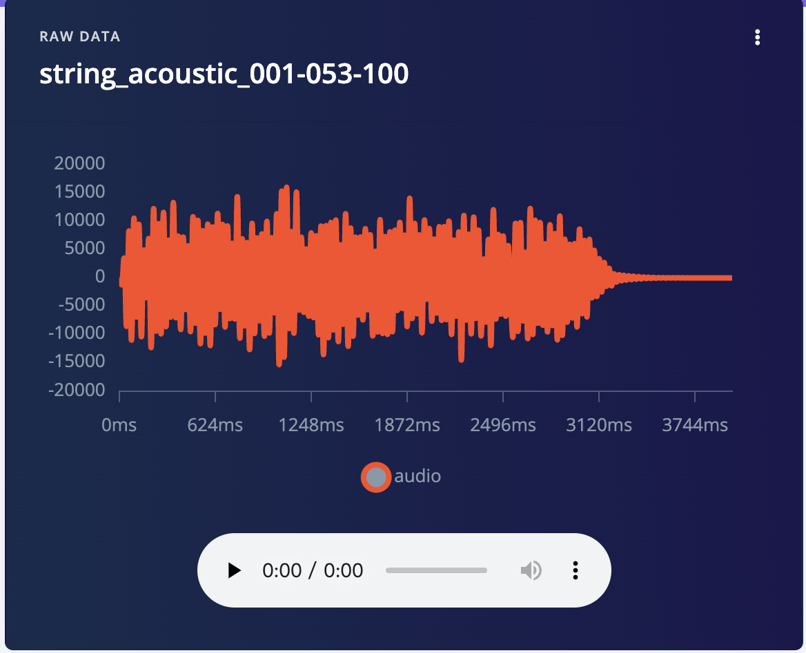

# String Instrument Audio Classification with MFCC Features and 2D CNNs on Arduino

```
Hongbing Qiu
ID： 24065411
```
GitHub: https://github.com/mk20661/String-Sense
EdgeImpulse: https://studio.edgeimpulse.com/public/678434/live 

## Introduction

This project aims to build an audio classification system based on deep learning. It can automatically identify three common stringed instruments—guitar, bass guitar, and other stringed instruments—and classify all non-stringed instruments and environmental noise as the "other" category, thereby achieving the four-classification task. The system is deployed on the Edge Impulse platform. Through feature extraction and model training of audio samples, it can efficiently classify the input sounds.

<p align="center">
  <br/>
  <b>Figure 1:</b> Project Overview
</p>

This project originated from the research interests in Music Information Retrieval (MIR) and TinyML. In recent years, the application of deep neural networks in audio signal processing has developed rapidly, demonstrating outstanding performance in tasks such as instrument recognition, music recommendation and automatic orchestration (Humphrey, Bello and LeCun, 2012). Meanwhile, the continuous improvement of microcontroller performance has made it possible to deploy efficient models on resource-constrained devices (Warden and Situnayake, 2019), promoting the deep integration of intelligent hardware and artificial intelligence technologies.

This project references the NSynth (Neural Synthesizer) project released by the Google Magenta team (NSynth, 2017), using its diverse monophonic audio data as the core data source. At the same time, the development process is designed and implemented based on the audio classification scheme of the Edge Impulse platform, leveraging its visual operation interface and rich device support. This significantly reduces the complexity of system development, making it especially suitable for rapid prototyping and verification of audio classification tasks.

## Research Question
This project explores how to accurately recognise and classify the sounds of various types of string musical instruments (guitar, bass, string) on resource-constrained embedded devices (such as Arduino Nano 33 BLE).

## Application Overview
This project system consists of a data processing platform, embedded hardware and interactive interface, forming a complete end-to-end audio recognition process. The data processing platform is based on Edge Impulse, completing audio sample collection, MFCC feature extraction and deep learning model training. It covers guitars, bass guitars, other stringed instruments and other categories (including non-stringed instruments and environmental noise), providing diverse training data for the model. In the feature extraction stage, Mel Frequency Cepstral Coefficients (MFCC) are used to capture the key perceptual features of audio, improving the classification accuracy. After training, the model is deployed in a quantised form to the Arduino Nano 33 BLE Sense microcontroller, supporting local inference in resource-constrained environments. The hardware part includes a microphone module (for real-time audio collection), physical buttons (for controlling the start of the recognition process) and an OLED display (for outputting inference results). After the button is triggered, the system collects audio and extracts features. It performs classification inference and then displays the recognition result (guitar/bass/string/other) in real time on the OLED screen in text form. The overall design focuses on low-power operation and independence, enabling stable and real-time local audio recognition applications without needing external servers or high-performance computing resources.

## Data
The data sources used in this project consist of two parts: Firstly, the NSynth dataset released by Google Magenta is adopted, and three types of target string instrument audio samples (guitar, bass, and string) are selected; Secondly, real guitar scale audio samples are collected autonomously through the onboard microphone of the Arduino Nano 33 BLE Sense board as supplementary data to enhance the model's adaptability in real scenarios(see figure 3).
<figure style="text-align: center;">
    <div style="display: inline-block; margin: 10px;">
        
        <figcaption>Figure 2a: Guitar</figcaption>
    </div>
    <div style="display: inline-block; margin: 10px;">
        
        <figcaption>Figure 2b: Bass</figcaption>
    </div>
        <div style="display: inline-block; margin: 10px;">
        
        <figcaption>Figure 2c: String</figcaption>
    </div>
    <figcaption><b>Figure 2:</b>  Instrument Audio</figcaption>
</figure>
<p align="center">
  <br/>
  <b>Figure 2:</b> Data Collect
</p>

To enhance the model's classification ability and generalisation performance, the "other" category is introduced, which includes non-string instrument samples randomly selected from the NSynth dataset (such as brass, reed, keyboard, etc.), to construct a more challenging four-class classification task.

During the data preprocessing stage, the guitar audio samples recorded autonomously were cropped and normalised in duration, making their duration consistent with that of the NSynth samples to ensure the consistency of feature extraction. Subsequently, Mel Frequency Cepstral Coefficients (MFCC) features were extracted using the Edge Impulse platform as the input for model training.

In terms of data partitioning, each category (guitar, bass, string, other) in the training set contains 100 samples, and each category in the test set contains 25 samples, ensuring a balanced category distribution and improving the stability of model training and the credibility of test results.


## Model

This project is based on the Edge Impulse platform. It builds a lightweight one-dimensional convolutional neural network (2D CNN) for audio classification tasks, aiming to identify four categories of sounds: guitar, bass, string, and other. The input data consists of extracted MFCC (Mel-Frequency Cepstral Coefficients) features, with extraction parameters set as follows: 13 coefficients, a frame length and frame shift of 0.02 seconds, 32 Mel filters, an FFT length of 256, and a frequency range of 0–8000 Hz.

The model architecture(see figure 4) includes an input layer (2600-dimensional features) that, after a Reshape operation, passes through two successive 2D convolution and pooling modules. The first convolutional layer uses 8 filters with a kernel size of 3×1, while the second uses 16 filters with the same kernel size. Each convolutional block is followed by a Dropout layer with a rate of 0.25 to mitigate the risk of overfitting. The extracted features are then flattened followed by an output layer that completes the four-class classification.

<p align="center">
  <br/>
  <b>Figure 4:</b> Model Architecture
</p>

During the model design process, attempts were made to adjust the number of convolutional layers and the quantity of convolutional kernels to further enhance the feature extraction capability. Experimental results indicated that increasing the depth or width of the network did indeed lead to higher accuracy on the training set, but it also resulted in a significant increase in inference latency, an increase in model resource occupation, and some configurations exceeding the load range of embedded devices. Considering the classification performance, inference speed, and resource occupation, this project ultimately selected a lightweight architecture based on 2D CNN. This architecture ensures low latency and reasonable model size while fully leveraging the advantages of two-dimensional convolution in time-frequency feature extraction, improving classification accuracy and overall system performance, and is suitable for efficient deployment and operation on edge devices.

## Experiments
This project has designed and conducted multiple sets of comparative experiments in multiple aspects, including feature extraction methods, window settings, and model architectures, to enhance the model's recognition performance in embedded scenarios.

Firstly, two feature extraction methods for audio, MFE (Mel Filterbank Energy) and MFCC (Mel-Frequency Cepstral Coefficients), were attempted at the feature level. And the visualisation comparison of the extraction results was conducted using the Feature Explorer tool of the Edge Impulse platform. As shown in the figure 5, the MFE feature (see figure 5a) can preliminarily distinguish four types of musical instruments in the overall distribution. Still, the clustering boundaries are relatively vague, and many overlapping phenomena exist among some categories. In contrast, the MFCC feature (see figure 5b) forms a more transparent clustering structure among the four types of samples, especially showing higher separability in the guitar, bass, and string categories, indicating that MFCC is more suitable as the input feature of the model.

<figure style="text-align: center;">
    <div style="display: inline-block; margin: 10px;">
        
        <figcaption>Figure 5a: MFE</figcaption>
    </div>
    <div style="display: inline-block; margin: 10px;">
        
        <figcaption>Figure 5b: MFCC</figcaption>
    </div>
    <figcaption><b>Figure 5:</b>  Feature Extraction</figcaption>
</figure>
In terms of window settings, considering that each audio sample in this project is an independent single-tone phase, the entire audio segment is input as a single window to the model. This avoids the truncation problem caused by sliding windows.

On the validation set, the 1D CNN model achieves 97.5% accuracy (Figure 6), with an inference latency of 10ms and a model size of about 34.4KB, making it lightweight and suitable for latency-sensitive embedded applications. 2D CNN model further improves its accuracy to 100% (Figure 7), but the inference latency increases to 129ms and the model size to 43.9 KB. Although resource consumption increases slightly, classification performance is fully optimised.
<figure style="text-align: center;">
    <div style="display: inline-block; margin: 10px;">
        
        <figcaption>Figure 6: 1D CNN Validation</figcaption>
    </div>
    <div style="display: inline-block; margin: 10px;">
        
        <figcaption>Figure 7: 2D CNN Validation</figcaption>
    </div>
</figure>

In the performance evaluation of the test set (refer to Figures 8 and 9), the 1D CNN model achieved an accuracy rate of 61.0% on the test set. In comparison, the accuracy rate of the 2D CNN model increased to 75.0%. Although both models can achieve high accuracy rates on the training and validation sets, the test set results further verified the superiority of the 2D CNN model: it has better generalisation ability. It can maintain higher classification accuracy on unseen data, while no obvious overfitting phenomenon was observed. Therefore, considering the model stability and actual deployment requirements comprehensively, the architecture based on 2D CNN was ultimately selected as the best solution for this project.
<figure style="text-align: center;">
    <div style="display: inline-block; margin: 10px;">
        
        <figcaption>Figure 8: 1D CNN Model Testing</figcaption>
    </div>
    <div style="display: inline-block; margin: 10px;">
        
        <figcaption>Figure 9: 2D CNN Model Testing</figcaption>
    </div>
</figure>

## Results and Observations
This project successfully constructed a string instrument classification system based on MFCC features and a 2D CNN model, which can be efficiently deployed on resource-constrained platforms such as Arduino Nano 33 BLE Sense. The final model achieved 100% accuracy on the validation set and 75% accuracy on the test set. The inference delay was 129ms, and the peak memory usage was 28.1KB, meeting the resource constraints requirements for embedded applications.

The experimental results show that the combination of MFCC features and 2D CNN architecture performs best in time-frequency feature extraction and classification accuracy. In contrast, 1D CNN has higher accuracy in training and validation stages, but is insufficient to distinguish the test set's string categories, indicating its limited ability to process two-dimensional feature maps.

Although the overall system runs stably, the accuracy on the test set is lower than that on the training and validation sets. This may be due to insufficient sample size, noise in the recording environment, and differences in data distribution. Future work can improve the system's generalisation ability and inference efficiency by expanding the dataset size, introducing data augmentation techniques (such as time offset, background noise superposition), and exploring more lightweight 2D CNN or mini-Transformer models.

## Bibliography

Engel, J., Resnick, C., Roberts, A., Dieleman, S., Eck, D., Simonyan, K. and Norouzi, M. (2017). Neural Audio Synthesis of Musical Notes with WaveNet Autoencoders. [online] arXiv.org. doi:https://doi.org/10.48550/arXiv.1704.01279.

Humphrey, E.J., Bello, J.P. and Yann LeCun (2012). Moving beyond feature design: Deep architectures and automatic feature learning in music informatics. International Symposium/Conference on Music Information Retrieval, pp.403–408.

NSynth (2017). The NSynth Dataset. [online] Magenta. Available at: https://magenta.tensorflow.org/datasets/nsynth [Accessed 1 Apr. 2025].

Warden, P. and Situnayake, D. (2019). TinyML. O’Reilly Media.

----

## Declaration of Authorship

I, HONGBING QIU, confirm that the work presented in this assessment is my own. Where information has been derived from other sources, I confirm that this has been indicated in the work.


*Hongbing Qiu*

26/04/2025

Word count: 1561 
